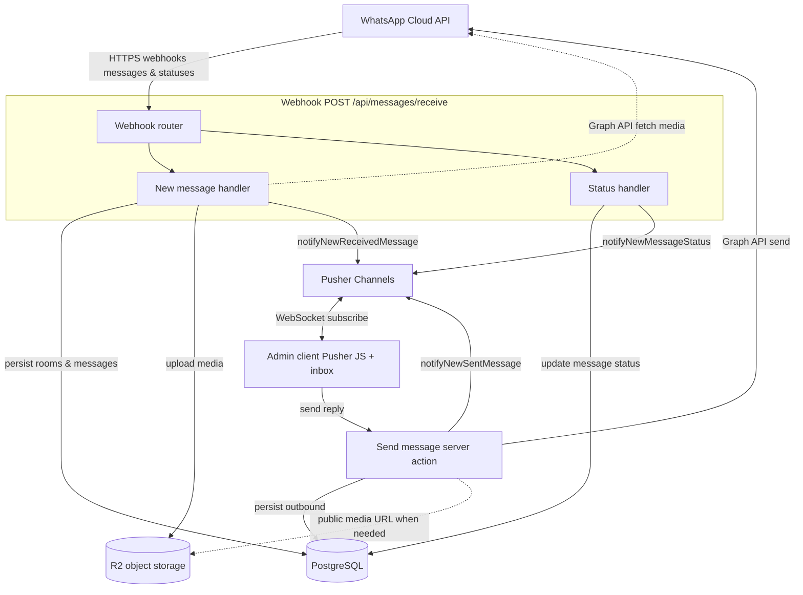

# Tecma

**Tecma** is a full-stack **property and tenant operations** platform. It gives property teams a single place to manage portfolios (buildings, units, leases, tenants), run **WhatsApp-based conversations** with residents, and track **maintenance and service tickets** end to end—with **role-based access**, **real-time updates**, and **file storage** wired for production-style workflows.

---

## What it does

Modern residential and commercial operators need more than spreadsheets: they need traceable communication, scoped staff access, and ticket history tied to leases. Tecma models **properties → units → tenants → leases**, connects **Meta WhatsApp Cloud API** conversations into **conversation rooms**, and layers a **ticketing system** (categories, assignments, status history, priorities) on top of that domain.

---

## Features

### Portfolio & tenancy

- **Properties, units, and tenants** with CRUD flows in the admin UI  
- **Leases** linking tenants to units with date ranges and status (`active`, `expired`, `terminated`)  
- **Per-property scoping** for staff via employee–property permissions

### WhatsApp & inbox

- **WhatsApp Business Account (WABA) records** (phone IDs, quality rating, etc.)  
- **Conversation rooms** per tenant and channel, with message history and room lifecycle (`active`, `closed`, `expired`)  
- **Inbound/outbound messaging** integrated with the WhatsApp Graph API (webhooks + send flows)  
- **Real-time inbox** using Pusher so the admin UI stays in sync without manual refresh  
- Support for multiple **message types** (text, media, etc.) and **delivery status** tracking in the data model

### Tickets & operations

- **Tickets** tied to a lease/property with **priority**, **status** (`open` → `in_progress` → `closed`), and optional **categories**  
- **Assignments** to employees and **progress entries** (status transitions, comments, optional images)  
- **Notifications** for property-scoped activity

### Access control & admin

- **Authentication** with credentials (bcrypt-hashed passwords)  
- **Roles and permissions** (string-based permission names, e.g. `dashboard:view`) enforced on server-rendered pages and actions  
- **Dashboard** with aggregate stats and charts (ticket mix, messaging activity over time)  
- **Data-heavy admin screens** built with TanStack Table (sorting, filtering patterns suitable for operations teams)

---

## Demo

The `/demo` folder at the repo root contains a **screen recording** and **UI screenshots** of the admin experience (inbox and related flows).

**Video**


**Screenshots**


---

## Technical highlights


| Area                      | Choices                                                                                                                                                                         |
| ------------------------- | ------------------------------------------------------------------------------------------------------------------------------------------------------------------------------- |
| **Framework**             | [Next.js](https://nextjs.org/) 16 (App Router), [React](https://react.dev/) 19, TypeScript                                                                                      |
| **Auth**                  | [NextAuth.js](https://next-auth.js.org/) v5 (Credentials provider, JWT/session callbacks, protected `/admin` routes)                                                            |
| **Data layer**            | [Prisma](https://www.prisma.io/) 7 + [PostgreSQL](https://www.postgresql.org/) via `@prisma/adapter-pg` and the `pg` driver                                                     |
| **Validation & forms**    | [Zod](https://zod.dev/) + [React Hook Form](https://react-hook-form.com/) with `@hookform/resolvers`                                                                            |
| **API surface**           | Route Handlers (`app/api/`**) for webhooks and JSON APIs; server actions under `lib/actions/`** for mutations                                                                   |
| **Client data**           | [SWR](https://swr.vercel.app/) for cached, revalidated fetches in the admin UI                                                                                                  |
| **Real-time**             | [Pusher](https://pusher.com/) (server + browser client) for inbox and live updates                                                                                              |
| **Messaging integration** | Meta **WhatsApp Cloud API** (Graph API, verify token, webhook receivers)                                                                                                        |
| **Object storage**        | **S3-compatible** uploads ([Cloudflare R2](https://www.cloudflare.com/developer-platform/r2/) via `@aws-sdk/client-s3` patterns in `lib/integrations`)                          |
| **UI**                    | [Tailwind CSS](https://tailwindcss.com/) 4, [Radix](https://www.radix-ui.com/)-style primitives, accessible components, [Recharts](https://recharts.org/) for dashboard visuals |
| **Observability**         | [Winston](https://github.com/winstonjs/winston) for structured logging                                                                                                          |


**Architecture notes**

- **Domain-driven schema**: leases anchor tickets; rooms tie tenants, properties, and WhatsApp channels; messages are indexed for room + time for efficient conversation loads.  
- **Permission model**: global role permissions plus **employee–property** grants for multi-site staff.  
- **Type safety** end to end: generated Prisma client, Zod at boundaries, typed API handlers.

### Real-time messaging architecture

This diagram focuses on **library integrations** for WhatsApp inbox: Meta’s **WhatsApp Cloud API**, the **webhook** entry point, separate handlers for **new messages** vs **delivery/read statuses**, **outbound send** via the Graph API, **R2** for durable media URLs, **Pusher** for pushing updates to browsers, and the **admin client** subscribing over WebSockets. **PostgreSQL** (via Prisma) is where rooms and messages are persisted after each handler runs.




**How to read it**

- **Inbound**: Meta calls the **webhook**; `**messages`** go to the **new message** handler (optional **Graph** fetch + **R2** upload for media, then DB + **Pusher**); `**statuses`** go to the **status** handler (DB + **Pusher** delivery/read updates).  
- **Outbound**: The **client** invokes **send message**, which writes to the DB, calls the **WhatsApp Cloud API**, and notifies subscribers via **Pusher**.  
- **Real-time**: **Pusher** is the bridge so the **client** inbox updates without polling for every change.

---

## Getting started

### Prerequisites

- **Node.js** (LTS recommended)  
- **PostgreSQL**  
- Optional for full features: Meta WhatsApp app, Pusher app, R2 (or compatible S3) bucket

### Setup

1. **Clone the repository** and install dependencies:
  ```bash
   npm install
  ```
2. **Environment** — copy the example file and fill in values:
  ```bash
   cp .env.example .env
  ```
   See `.env.example` for `DATABASE_URL`, `AUTH_SECRET`, admin bootstrap credentials, WhatsApp Graph tokens, Pusher keys, and R2/S3 settings.
3. **Database** — apply migrations and (optionally) seed:
  ```bash
   npx prisma migrate dev
   npx prisma db seed
  ```
4. **Run the dev server**:
  ```bash
   npm run dev
  ```
   Open [http://localhost:3000](http://localhost:3000). Sign-in is configured for the admin app (see your `.env` for initial admin email/password if you use the seed).

---

## Scripts


| Command         | Description                  |
| --------------- | ---------------------------- |
| `npm run dev`   | Start Next.js in development |
| `npm run build` | Production build             |
| `npm run start` | Run production server        |
| `npm run lint`  | ESLint                       |


---

## License

Private / unpublished

---

*Built to demonstrate production-minded full-stack work: relational modeling, third-party integrations, real-time UX, and secure, permission-aware admin tooling.*